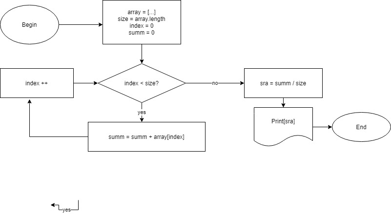

# Instructions for Mark Down

## Text highliggit checkout listshting

Чтобы выделить текст курсивом необходимо обрамить его (*) или знаком нижнего подчёркивания (_). Например , *вот так*или _вот так_.

Чтобы выделить текст полужирным ,необходимо обрамить его двойными звёзочками (**) или двойным знаком нижнего подчёркивания (__). Например , **вот так** или __вот так__.

Альтернативные способы выделения текста жирным или курсиовм нужны для того,чтобы мы могли сознавать оба этих способа. Например , _текст можеть быть выделен курсивом и при этом быть **полужирным**_.

## List

 Чтобы добавить ненумерованнные списки, необходимо пункты выделить (*) или знаком +. Например, вот так :
 * Элемент 1
 * Элемент 2
 * Элемент 3
 + Элемент 4

 Чтобы добавить нумерованные списки ,необходимо пункты просто пронумеровать :

 1. Первый пункт
 2. Второй пункт

## Work with pictures

Чтобы вставить изображение в текст, достаточно следующее : 

 

## Links

## Work with tables

## Quotes

## Conclusion